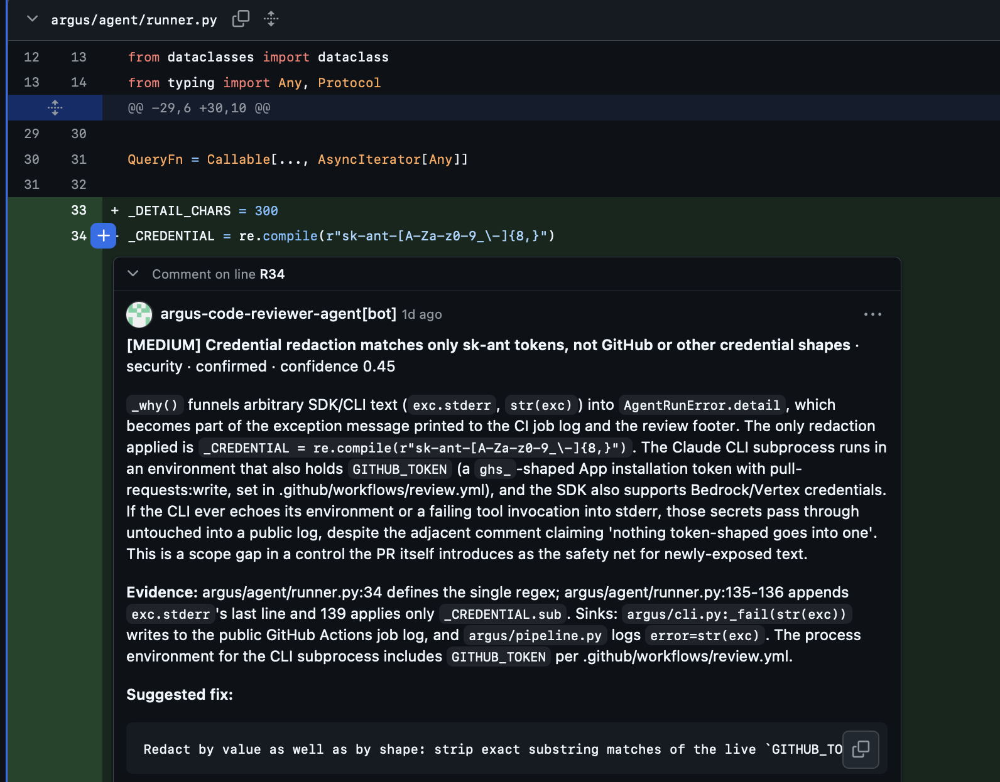
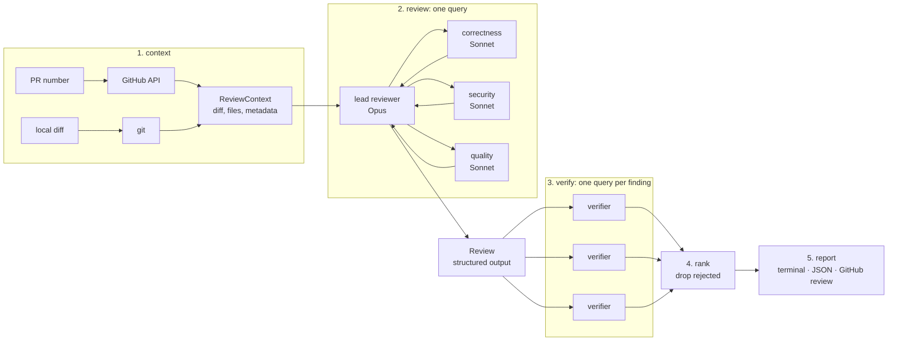

# Argus

[](https://github.com/hamseabd/argus/actions/workflows/ci.yml)

Argus is a multi-agent code-review harness built on the [Claude Agent SDK](https://docs.anthropic.com/en/docs/agent-sdk/overview) (Python).
A lead reviewer orchestrates three parallel specialist subagents, an independent verifier agent tries to refute every finding before it is reported, and what survives lands on the pull request as inline review comments.
The harness is read-only by construction, runs for $0 on GitHub Actions, and reviews its own pull requests.

**Sample review:** [Argus reviewing the pull request that gave it this identity](https://github.com/hamseabd/argus/pull/10#pullrequestreview-5189614285).
It confirmed that the new app token was minted without narrowing its permissions, which the next commit fixed, and the footer carries the per-agent telemetry.
It reviews other repositories the same way: [a review in apex-agent](https://github.com/hamseabd/apex-agent/pull/5#pullrequestreview-5186879344) caught a supply-chain risk in the workflow that calls it.

**Write-up:** [I built the code-review agent. Here's what the whiteboard version leaves out.](https://hamseabd.github.io/posts/argus-code-review-agent/)
Why it verifies by refutation, why it indexes nothing, and what the per-agent telemetry changed.



An inline finding on [PR #21](https://github.com/hamseabd/argus/pull/21#discussion_r4002077053): the redaction regex covered Claude tokens but not the GitHub token in the same environment.
The verifier confirmed it, and the fix landed with a test before merge.

## What it does

- **Reviews a pull request or a local diff.** `argus review --pr 7 --post` or `argus review --diff --base main`.
- **Orchestrates specialists.** One `query()` runs a lead reviewer on Opus as the orchestrator: it must delegate to `correctness`, `security`, and `quality` subagents on Sonnet in one turn (fan-out), then merges and de-duplicates what they return (fan-in). The lead does not re-check findings itself; that is the verifier's job.
- **Verifies before it reports.** Every finding gets its own fresh verifier query whose only job is to refute it by reading the code. Rejected findings are dropped; failed verifications are reported as `unverified`, never as confirmed.
- **Posts inline.** A finding lands as a review comment on its line when that line is in the diff, otherwise in the review body. The review never requests changes; merge gating is the CLI exit code.
- **Never touches the repository.** Reviewers get `Read`, `Grep`, `Glob`, `Agent`, and one custom read-only tool served by an in-process MCP server. Mutating tools are removed from the tool set and denied again by a `PreToolUse` hook, so the guardrail is layered, not a prompt instruction.
- **Explains itself.** Structured JSON telemetry carries cost, tokens, turns, duration, subagent count, and rejected structured outputs per stage, plus a tool-call audit trail, under one `run_id`. The review stage is attributed per agent: turns, tool calls, tokens, and duration for the lead and each specialist, in the JSON artifact and the report footer. With an OTLP endpoint set, each review is also one OpenTelemetry trace: the run, the review and each verification, and under them every model turn and tool call of the lead and each specialist, with tokens; see [Tracing](#tracing).

## Design decisions

- **Python is the harness: it owns the pipeline, and the SDK owns the fan-out inside one query.** The pipeline speaks domain types behind a `ReviewAgent` protocol, so the whole flow runs under test with a fake agent, and only `argus/agent/` imports the SDK, which [`tests/test_boundaries.py`](tests/test_boundaries.py) enforces.
- **Every finding faces independent verification: a fresh query whose only job is to refute it, not the lead that reported it.** The lead re-checking its own findings was measured and removed ([#9](https://github.com/hamseabd/argus/pull/9); the numbers are [under Cost](#what-the-measurements-changed)).
A finding that survives an independent refutation attempt is reported; one that fails is reported as `unverified`, never as confirmed.
- **Read-only by three layered guardrails: the tool set, a `PreToolUse` deny hook, and `setting_sources=[]`.** Defense in depth: the model has no mutating or network tool, so a prompt injection in a diff cannot write, execute, or exfiltrate, and the repository under review cannot reach the reviewer through its own settings, hooks, or `CLAUDE.md` ([`argus/agent/options.py`](argus/agent/options.py), [`argus/agent/hooks.py`](argus/agent/hooks.py)).
- **Structured output is validated against a JSON Schema derived from the Pydantic domain models, with length floors on prose fields.** The schema and the model cannot drift, and a placeholder that merely fits the shape is rejected and counted ([#13](https://github.com/hamseabd/argus/pull/13)).
- **A subscription token, no API key, and no cloud resources.** The cost to operate is $0: a review costs subscription quota, and the SDK still reports what it would have cost on the API.

## Architecture



Python is the harness and owns the pipeline; the SDK owns the fan-out inside the review stage.

| Layer | Package | Role |
|---|---|---|
| Domain | `argus/domain/` | Pydantic models (`Finding`, `Review`, `Verdict`, `ReviewResult`) and typed errors. No SDK imports. |
| Context | `argus/context/` | Unified diff parser with the commentable-line index and a 200 KB size cap; local diff via git; GitHub client. |
| Agent | `argus/agent/` | The only package that imports `claude_agent_sdk`: options, output schemas, hooks, the `git_history` MCP tool, the runner, and the prompts. |
| Pipeline | `argus/pipeline.py` | Stage orchestration over domain types, behind a `ReviewAgent` protocol so it is tested with a fake agent. |
| Report | `argus/report/` | Terminal Markdown and the GitHub review payload. |
| CLI | `argus/cli.py` | Typer. Imports the SDK lazily so `argus version` and the pipeline never load it. |

That boundary is enforced by a test: a source scan proves only `argus/agent/` mentions the SDK, and a subprocess import proves the other modules never load it.

### How a review runs

1. **Context.** PR mode fetches the diff, changed files, and metadata from the GitHub REST API. Local mode diffs from the merge base with the base branch to the working tree. Files are dropped from the diff, largest first, until it fits the context budget; the lead is told which ones to read directly.
2. **Review.** The lead gets the change and must delegate to all three specialists in one turn. Each specialist returns a JSON array of findings. The lead merges them and answers with a `Review` as structured output, validated by the SDK against a JSON Schema derived from the domain model and re-validated by Pydantic. The schema puts a length floor on the summary (and on the verifier's reasoning), so a placeholder that merely fits the shape is rejected and the model has to write the real thing; how many outputs were rejected before one validated is part of every stage's metrics.
The lead gets a small budget of its own reads (ten), enforced by a hook: once it runs out, reading is refused and the only move left is to answer. Delegation and the answer itself are never refused.
3. **Verify.** Each finding runs in its own verifier query with only the finding and its diff hunk. The verifier confirms only if the code path actually exhibits the issue. At most four run at once.
4. **Rank.** Rejected findings are dropped. The rest are ordered confirmed before unverified, then by severity, then by path.
5. **Report.** Markdown in the terminal, a JSON artifact with `--json`, and with `--post` a GitHub review with inline comments.

### Read-only guarantees

- `tools` and `allowed_tools` restrict the model to `Read`, `Grep`, `Glob`, `Agent`, and `mcp__argus__git_history`: least privilege at the tool layer.
- A `PreToolUse` hook denies `Write`, `Edit`, `MultiEdit`, `NotebookEdit`, `Bash`, `WebFetch`, and `WebSearch` with a reason the model can read, so it does not retry.
- `setting_sources=[]` isolates every query from the repository under review: its `.claude/` settings, hooks, and `CLAUDE.md` cannot reach the reviewer.
- `git_history`, the one custom tool, is served by an in-process MCP server and runs `git log -L` for a line range and refuses paths outside the repository root. In local mode it maps working-tree line numbers to HEAD through the uncommitted hunks and labels lines that have no history yet.
- The dogfood workflow installs and runs Argus from the default branch and only reads the pull request head, so the trust boundary is the checkout: a PR cannot execute its own code next to the token.

## Cost

### What a review costs

Argus authenticates with a Claude subscription token from `claude setup-token` (`CLAUDE_CODE_OAUTH_TOKEN`), so a review costs quota, not money.
The SDK still reports what the same run would have cost on the API, and the JSON artifact breaks it down per stage.

| Run | Cost | Time | Turns |
|---|---|---|---|
| [PR #7](https://github.com/hamseabd/argus/pull/7#pullrequestreview-5174291207): 2 files, 6 findings, 6 verifications | $2.34 | 306 s | 48 |
| [PR #8](https://github.com/hamseabd/argus/pull/8#pullrequestreview-5178840171): 3 files, 0 findings | $1.37 | 128 s | 22 |
| PR #8 re-run locally with the current prompts: 1 finding, 1 verification | $1.02 | 190 s | 5 |
| [PR #15](https://github.com/hamseabd/argus/pull/15#pullrequestreview-5184949615): 4 files, 0 findings, lead 2 turns | $0.50 | 91 s | 5 |
| [PR #10](https://github.com/hamseabd/argus/pull/10#pullrequestreview-5189614285): 4 files, 1 finding, lead 43 tool calls | $2.49 | 319 s | 12 |

Most of the input is prompt-cache reads: 805,554 of 805,620 input tokens on PR #7.
The three specialists are the rest of a review and vary between runs ($0.48 to $0.94 on the same diff).
Caps keep a runaway review short: the lead stops at 40 turns or $3.00, each specialist at 25 turns, each verifier at 10 turns or $0.50.

### What the measurements changed

- **[#9](https://github.com/hamseabd/argus/pull/9).** The first two runs let the lead re-check findings itself, and it did: 22 to 26 Opus turns re-reading code, $0.88 of the $1.37 on PR #8.
That is the verify stage's job, so the lead now delegates, merges, and returns, and its own thread costs about $0.06.
- **[#11](https://github.com/hamseabd/argus/pull/11).** A Sonnet lead was measured on the same diff as well ($0.73, same finding) but it delegated one specialist at a time and made no-op Agent calls, so the lead stays on Opus, where its share of the cost is now negligible.
- **[#14](https://github.com/hamseabd/argus/pull/14).** The SDK reports usage for a query as a whole, so Argus does per-agent attribution itself: each assistant message names the Agent call that spawned its author, and the tool hooks carry the subagent's id, which together give turns, tokens, tool calls, and duration per agent; a specialist that uses every turn it has is logged as `specialist_turn_cap`, since its findings may be incomplete.
- **[#15](https://github.com/hamseabd/argus/pull/15).** The specialist cap was 15 until the per-agent telemetry showed the quality specialist using all of them on three reviews in a row and reporting nothing; a capped run costs the same and returns less.
- **[#19](https://github.com/hamseabd/argus/pull/19).** What is left of the spread is the lead's own reading. Per-agent telemetry put a number on it: 2 tool calls on the $0.42 review of PR #18, 43 on the $2.49 review of PR #10, where it also delegated to its three specialists 16 seconds apart instead of in one message.
The prompt had forbidden both for several increments, so the read budget is enforced in a hook instead, which bounds the expensive tail without touching a normal review.

## Usage

```bash
uv sync
export CLAUDE_CODE_OAUTH_TOKEN=...   # from `claude setup-token`; omitted, the machine login is used

argus review --diff --base main                 # the current branch, terminal report
argus review --pr 7 --repo owner/name --post    # a pull request, posted as a review (needs GITHUB_TOKEN)
argus review --diff --json argus-review.json --fail-on high
```

| Option | Meaning |
|---|---|
| `--pr N` / `--diff` | Choose one. `--repo` defaults to `GITHUB_REPOSITORY`, then the origin remote. |
| `--base REF` | Base for `--diff`. Default `main`. |
| `--post` | Post the review on the pull request. Needs `--pr` and `GITHUB_TOKEN`. |
| `--json PATH` | Write the full `ReviewResult`, written before posting so a posting failure still leaves the record. |
| `--no-verify` | Skip the verify stage; every finding is reported as `unverified`. |
| `--fail-on SEVERITY` | Exit 3 if any confirmed or unverified finding is at or above `critical`, `high`, `medium`, or `low`. |

Exit codes: `0` success, `1` error, `2` bad command line, `3` severity gate tripped.

Models, efforts, caps, and concurrency are settings, overridable as `ARGUS_*` environment variables (`ARGUS_LEAD_MODEL`, `ARGUS_VERIFY_CONCURRENCY`, `ARGUS_LOG_FORMAT`, `ARGUS_LOG_LEVEL`, and so on; see `argus/settings.py`).

### Tracing

Set `OTEL_EXPORTER_OTLP_ENDPOINT` (and `OTEL_EXPORTER_OTLP_HEADERS` for auth) and a review is exported as one OpenTelemetry trace; unset, nothing is exported.
Argus builds the spans itself from the SDK's message stream and hooks and turns Claude Code's native telemetry off, because the native spans carry the account's email and ids, and a backend that keeps only the attributes it maps (LangSmith) shows them without tool names or tokens.
Spans follow the `gen_ai` conventions plus LangSmith's keys; tool inputs are summarized and redacted as in the logs, and prompts, output, and model text are only included with `ARGUS_TRACE_CONTENT=true`.
`LANGSMITH_API_KEY` is your LangSmith API key; set it first.

```bash
export OTEL_EXPORTER_OTLP_ENDPOINT=https://api.smith.langchain.com/otel
export OTEL_EXPORTER_OTLP_HEADERS="x-api-key=$LANGSMITH_API_KEY,Langsmith-Project=argus"
argus review --diff --base main
```

### As a GitHub Action

[`.github/workflows/review.yml`](.github/workflows/review.yml) reviews pull requests on this repository when they open or leave draft, and on demand for a PR number.
It does not run on every push, so a busy branch neither burns quota nor stacks duplicate reviews.
Pull requests from forks and from Dependabot are skipped, because GitHub gives neither any secrets; a maintainer can still review one on demand.
The review is posted by a GitHub App named Argus, through a short-lived installation token minted just before the review step and revoked when the job ends, so it appears under Argus's own identity and the workflow's own token stays read-only.
The workflow needs three repository secrets: `CLAUDE_CODE_OAUTH_TOKEN`, and the app's `ARGUS_APP_ID` and `ARGUS_APP_PRIVATE_KEY`.
An optional fourth, `LANGSMITH_API_KEY`, traces each review to LangSmith; without it nothing is exported.
The app needs `Pull requests: Read and write` and `Contents: Read-only`, and must be installed on the repository.

#### Reviewing another repository

The same file is a reusable workflow, so any repository can have Argus review its pull requests with a small caller workflow, the same three secrets, and the Argus app installed on it.
The caller below is [apex-agent](https://github.com/hamseabd/apex-agent/pull/7)'s, with the pin updated to the current `v1`; Argus reviewed its first draft there and asked for the commit pin and the explicit draft and fork guard:

```yaml
# .github/workflows/argus-review.yml
name: argus-review
on:
  pull_request:
    types: [opened, ready_for_review]
permissions:
  contents: read
jobs:
  review:
    if: >-
      github.event.pull_request.draft == false &&
      github.event.pull_request.head.repo.full_name == github.repository
    uses: hamseabd/argus/.github/workflows/review.yml@499078048d2e6d46f557d61f5bbae4e14f9af9ce # v1
    secrets:
      CLAUDE_CODE_OAUTH_TOKEN: ${{ secrets.CLAUDE_CODE_OAUTH_TOKEN }}
      ARGUS_APP_ID: ${{ secrets.ARGUS_APP_ID }}
      ARGUS_APP_PRIVATE_KEY: ${{ secrets.ARGUS_APP_PRIVATE_KEY }}
```

To trace your reviews, pass `LANGSMITH_API_KEY: ${{ secrets.LANGSMITH_API_KEY }}` as well; it is optional.

Argus is checked out from this repository at the commit the caller pinned, never from the repository under review, so the trust model is unchanged: the pull request is read, not executed.
Pin the commit, as above, because the workflow receives a secret and write access and a moving tag is a supply-chain risk; `v1` is a tag this repository moves forward with compatible releases, and the comment records which release the commit is.
That caller is for `pull_request` events; its guard assumes one.
To review a pull request from another event, such as your own `workflow_dispatch`, call the workflow with `with: pr: ${{ inputs.pr }}` and drop the guard.
Do not add a `concurrency` group to the caller: the reusable workflow already keys one on the pull request number, and a caller group with the same key makes GitHub cancel both runs as a deadlock at startup.
Argus reads diffs and files, so the language of the reviewed repository does not matter.

## How it was built

- **The design came before the code.** A design spec and an increment plan were committed before the first line of code ([`a26ca3e`](https://github.com/hamseabd/argus/commit/a26ca3e)).
- **One increment, one branch, one pull request, one squash-merge.** Every pull request body has the same four parts: why, what changed, a definition of done, and the verification output pasted in ([#19](https://github.com/hamseabd/argus/pull/19) is the shape).
- **The failing test comes first.** The unit tests run offline without credentials or network: the pipeline through a fake agent, the runner through a recorded SDK message stream, the GitHub client through `respx`, and the diff parser against fixtures that git itself generated.
An opt-in live test is the end-to-end eval: it builds a repository with a seeded SQL injection and an off-by-one on a feature branch and asserts Argus, running against the real SDK, confirms a finding in one of the seeded files ([`tests/test_live.py`](tests/test_live.py)).
- **Architecture rules are tests, not comments.** [`tests/test_boundaries.py`](tests/test_boundaries.py) proves that only `argus/agent/` imports the SDK, by source scan and by a subprocess import, and that nothing in the package prints; [`tests/test_workflows.py`](tests/test_workflows.py) asserts the review workflow's triggers, permissions, timeout, and concurrency.
- **Argus reviews its own pull requests.** Every pull request since [#7](https://github.com/hamseabd/argus/pull/7), which landed the dogfood workflow, is reviewed by Argus via the Action, and each finding is dispositioned in the thread: on [#21](https://github.com/hamseabd/argus/pull/21) two were fixed before merge.
- **Decisions were changed by measurement, not preference.** [What the measurements changed](#what-the-measurements-changed) lists the five.
- Claude Code was the pair programmer throughout; the design, the failing tests, the review of every diff, and every merge were the author's.

## Development

```bash
uv sync                      # create .venv and install everything
uv run ruff check .          # lint
uv run ruff format --check . # format check
uv run pytest -q             # unit tests, offline
uv run pytest -m live -s     # opt-in: the real SDK against a seeded-bug fixture
```

What those tests cover is described under [How it was built](#how-it-was-built).

## License

MIT.
