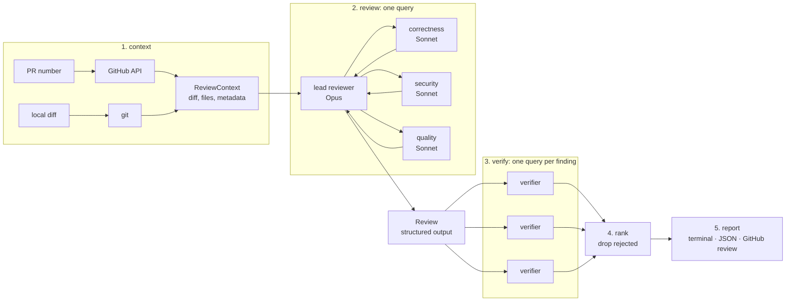

# Argus

[](https://github.com/hamseabd/argus/actions/workflows/ci.yml)

Argus is a code-review agent built on the [Claude Agent SDK](https://docs.anthropic.com/en/docs/agent-sdk/overview) (Python).
A lead reviewer fans out to three parallel specialist subagents, every finding is checked by an independent verifier before it is reported, and the result lands on the pull request as inline review comments.
It is read-only by construction, it runs for $0 on GitHub Actions, and it reviews its own pull requests.

**Sample review:** [Argus reviewing the pull request that added its own review workflow](https://github.com/hamseabd/argus/pull/7#pullrequestreview-5174291207).
Six inline findings, all confirmed by the verifier, including two real trust-model flaws that the next commit fixed.

## What it does

- **Reviews a pull request or a local diff.** `argus review --pr 7 --post` or `argus review --diff --base main`.
- **Fans out to specialists.** One `query()` runs a lead reviewer on Opus that must delegate to `correctness`, `security`, and `quality` subagents on Sonnet, then merges and de-duplicates what they find. The lead does not re-check findings itself; that is the verifier's job.
- **Verifies before it reports.** Every finding gets its own fresh query whose only job is to refute it by reading the code. Rejected findings are dropped; failed verifications are reported as `unverified`, never as confirmed.
- **Posts inline.** A finding lands as a review comment on its line when that line is in the diff, otherwise in the review body. The review never requests changes; merge gating is the CLI exit code.
- **Never touches the repository.** Reviewers get `Read`, `Grep`, `Glob`, `Agent`, and one custom read-only tool. Mutating tools are removed from the tool set and denied again by a `PreToolUse` hook.
- **Explains itself.** Structured JSON logs carry cost, tokens, turns, duration, subagent count, and rejected structured outputs per stage, plus a tool-call audit trail, under one `run_id`. The review stage is also broken down per agent: turns, tool calls, tokens, and duration for the lead and each specialist, in the JSON artifact and the report footer.

## Architecture



Python owns the pipeline; the SDK owns the fan-out inside the review stage.

| Layer | Package | Role |
|---|---|---|
| Domain | `argus/domain/` | Pydantic models (`Finding`, `Review`, `Verdict`, `ReviewResult`) and typed errors. No SDK imports. |
| Context | `argus/context/` | Unified diff parser with the commentable-line index and a 200 KB size cap; local diff via git; GitHub client. |
| Agent | `argus/agent/` | The only package that imports `claude_agent_sdk`: options, output schemas, hooks, the `git_history` tool, the runner, and the prompts. |
| Pipeline | `argus/pipeline.py` | Stage orchestration over domain types, behind a `ReviewAgent` protocol so it is tested with a fake agent. |
| Report | `argus/report/` | Terminal Markdown and the GitHub review payload. |
| CLI | `argus/cli.py` | Typer. Imports the SDK lazily so `argus version` and the pipeline never load it. |

That boundary is enforced by a test: a source scan proves only `argus/agent/` mentions the SDK, and a subprocess import proves the other modules never load it.

### How a review runs

1. **Context.** PR mode fetches the diff, changed files, and metadata from the GitHub REST API. Local mode diffs from the merge base with the base branch to the working tree. Files are dropped from the diff, largest first, until it fits the cap; the lead is told which ones to read directly.
2. **Review.** The lead gets the change and must delegate to all three specialists in one turn. Each specialist returns a JSON array of findings. The lead merges them and answers with a `Review` as structured output, validated by the SDK against a schema derived from the domain model and re-validated by Pydantic. The schema puts a length floor on the summary (and on the verifier's reasoning), so a placeholder that merely fits the shape is rejected and the model has to write the real thing; how many outputs were rejected before one validated is part of every stage's metrics.
3. **Verify.** Each finding runs in its own query with only the finding and its diff hunk. The verifier confirms only if the code path actually exhibits the issue. At most four run at once.
4. **Rank.** Rejected findings are dropped. The rest are ordered confirmed before unverified, then by severity, then by path.
5. **Report.** Markdown in the terminal, a JSON artifact with `--json`, and with `--post` a GitHub review with inline comments.

### Read-only guarantees

- `tools` and `allowed_tools` restrict the model to `Read`, `Grep`, `Glob`, `Agent`, and `mcp__argus__git_history`.
- A `PreToolUse` hook denies `Write`, `Edit`, `MultiEdit`, `NotebookEdit`, `Bash`, `WebFetch`, and `WebSearch` with a reason the model can read, so it does not retry.
- `setting_sources=[]` isolates every query from the repository under review: its `.claude/` settings, hooks, and `CLAUDE.md` cannot reach the reviewer.
- `git_history`, the one custom tool, runs `git log -L` for a line range and refuses paths outside the repository root. In local mode it maps working-tree line numbers to HEAD through the uncommitted hunks and labels lines that have no history yet.
- The dogfood workflow installs and runs Argus from the default branch and only reads the pull request head, so a PR cannot execute its own code next to the token.

## Cost

Argus authenticates with a Claude subscription token from `claude setup-token` (`CLAUDE_CODE_OAUTH_TOKEN`), so a review costs quota, not money.
The SDK still reports what the same run would have cost on the API, and the JSON artifact breaks it down per stage.

| Run | Cost | Time | Turns |
|---|---|---|---|
| [PR #7](https://github.com/hamseabd/argus/pull/7#pullrequestreview-5174291207): 2 files, 6 findings, 6 verifications | $2.34 | 306 s | 48 |
| [PR #8](https://github.com/hamseabd/argus/pull/8#pullrequestreview-5178840171): 3 files, 0 findings | $1.37 | 128 s | 22 |
| PR #8 with the current prompts: 1 finding, 1 verification | $1.02 | 190 s | 5 |
| [PR #15](https://github.com/hamseabd/argus/pull/15#pullrequestreview-5184949615): 4 files, 0 findings, lead 2 turns | $0.50 | 91 s | 5 |

Most of the input is cache reads: 805,554 of 805,620 input tokens on PR #7.
The first two runs let the lead re-check findings itself, and it did: 22 to 26 Opus turns re-reading code, $0.88 of the $1.37 on PR #8.
That is the verify stage's job, so the lead now delegates, merges, and returns, and its own thread costs about $0.06.
A Sonnet lead was measured on the same diff as well ($0.73, same finding) but it delegated one specialist at a time and made no-op Agent calls, so the lead stays on Opus, where its share of the cost is now negligible.
The three specialists are now the bulk of a review and vary the most between runs ($0.48 to $0.94 on the same diff).
The SDK reports usage for a query as a whole, so Argus attributes it itself: each assistant message names the Agent call that spawned its author, and the tool hooks carry the subagent's id, which together give turns, tokens, tool calls, and duration per agent; a specialist that uses every turn it has is logged as `specialist_turn_cap`, since its findings may be incomplete.
Caps keep a runaway review short: the lead stops at 40 turns or $3.00, each specialist at 25 turns, each verifier at 10 turns or $0.50.
The specialist cap was 15 until the per-agent telemetry showed the quality specialist using all of them on three reviews in a row and reporting nothing; a capped run costs the same and returns less.

## Usage

```bash
uv sync
export CLAUDE_CODE_OAUTH_TOKEN=...   # from `claude setup-token`; omitted, the machine login is used

argus review --diff --base main                 # the current branch, terminal report
argus review --pr 7 --repo owner/name --post    # a pull request, posted as a review (needs GITHUB_TOKEN)
argus review --diff --json argus-review.json --fail-on high
```

| Option | Meaning |
|---|---|
| `--pr N` / `--diff` | Choose one. `--repo` defaults to `GITHUB_REPOSITORY`, then the origin remote. |
| `--base REF` | Base for `--diff`. Default `main`. |
| `--post` | Post the review on the pull request. Needs `--pr` and `GITHUB_TOKEN`. |
| `--json PATH` | Write the full `ReviewResult`, written before posting so a posting failure still leaves the record. |
| `--no-verify` | Skip the verify stage; every finding is reported as `unverified`. |
| `--fail-on SEVERITY` | Exit 3 if any confirmed or unverified finding is at or above `critical`, `high`, `medium`, or `low`. |

Exit codes: `0` success, `1` error, `2` bad command line, `3` severity gate tripped.

Models, efforts, caps, and concurrency are settings, overridable as `ARGUS_*` environment variables (`ARGUS_LEAD_MODEL`, `ARGUS_VERIFY_CONCURRENCY`, `ARGUS_LOG_FORMAT`, `ARGUS_LOG_LEVEL`, and so on; see `argus/settings.py`).

### As a GitHub Action

[`.github/workflows/review.yml`](.github/workflows/review.yml) reviews pull requests on this repository when they open or leave draft, and on demand for a PR number.
It does not run on every push, so a busy branch neither burns quota nor stacks duplicate reviews.
The review is posted by a GitHub App named Argus, through an installation token minted just before the review step and revoked when the job ends, so it appears under Argus's own name and the workflow's own token stays read-only.
The workflow needs three repository secrets: `CLAUDE_CODE_OAUTH_TOKEN`, and the app's `ARGUS_APP_ID` and `ARGUS_APP_PRIVATE_KEY`.
The app needs `Pull requests: Read and write` and `Contents: Read-only`, and must be installed on the repository.

#### Reviewing another repository

The same file is a reusable workflow, so any repository can have Argus review its pull requests with a small caller workflow, the same three secrets, and the Argus app installed on it.
The caller below is the one [apex-agent](https://github.com/hamseabd/apex-agent/pull/5) runs; Argus reviewed its first draft there and asked for the commit pin, the explicit draft and fork guard, and the concurrency group:

```yaml
# .github/workflows/argus-review.yml
name: argus-review
on:
  pull_request:
    types: [opened, ready_for_review]
permissions:
  contents: read
concurrency:
  group: argus-${{ github.event.pull_request.number }}
  cancel-in-progress: true
jobs:
  review:
    if: >-
      github.event.pull_request.draft == false &&
      github.event.pull_request.head.repo.full_name == github.repository
    uses: hamseabd/argus/.github/workflows/review.yml@e8847dfe8ff24dae9c46a4bcfe925bdda80e0054 # v1
    secrets:
      CLAUDE_CODE_OAUTH_TOKEN: ${{ secrets.CLAUDE_CODE_OAUTH_TOKEN }}
      ARGUS_APP_ID: ${{ secrets.ARGUS_APP_ID }}
      ARGUS_APP_PRIVATE_KEY: ${{ secrets.ARGUS_APP_PRIVATE_KEY }}
```

Argus is checked out from this repository at the commit the caller pinned, never from the repository under review, so the trust model is unchanged: the pull request is read, not executed.
Pin the commit, as above, because the workflow receives a secret and write access; `v1` is a tag this repository moves forward with compatible releases, and the comment records which release the commit is.
That caller is for `pull_request` events; its guard and concurrency group assume one.
To review a pull request from another event, such as your own `workflow_dispatch`, call the workflow with `with: pr: ${{ inputs.pr }}`, key the concurrency group on that number, and drop the guard.
Argus reads diffs and files, so the language of the reviewed repository does not matter.

## Development

```bash
uv sync                      # create .venv and install everything
uv run ruff check .          # lint
uv run ruff format --check . # format check
uv run pytest -q             # unit tests, offline
uv run pytest -m live -s     # opt-in: the real SDK against a seeded-bug fixture
```

The unit tests run without credentials or network: the pipeline is exercised through a fake agent, the runner through a recorded message stream, the GitHub client through `respx`, and the diff parser against fixtures that git itself generated.
The live test builds a repository with a seeded SQL injection and an off-by-one on a feature branch and asserts Argus confirms a finding in one of the seeded files.

Work ships in increments, each one branch, one pull request with its verification pasted in the body, and one squash-merge.
Since the review workflow landed, every pull request is reviewed by Argus itself.

## License

MIT.
